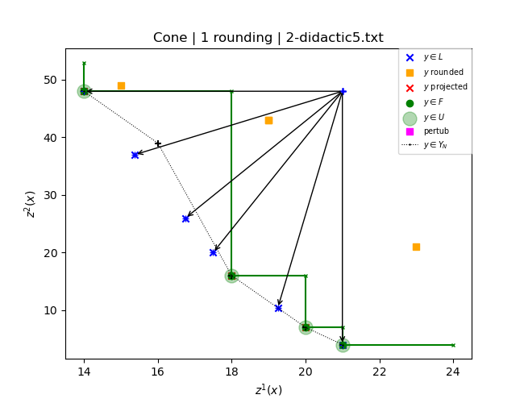

# GravityMachine
A primal heuristic to compute an upper bound set for multi-objective 0-1 linear optimisation problems

« Gravity Machine » is an algorithm aiming to compute an upper bound set for a multi-objective linear optimisation problem with binary variables.
Inspired by the well known « Feasibility Pump » algorithm in single objective optimisation, it belongs to the class of primal heuristics.

Here after an example of result for the instance `biodidactic5.txt`:

**References:**

Xavier Gandibleux, Guillaume Gasnier and Saïd Hanafi. A primal heuristic to compute an upper bound set for multi-objective 0-1 linear optimisation problems. MODeM '21: 1st Multi-Objective Decision Making Workshop, July 14-16, 2021. [http://modem2021.cs.nuigalway.ie/](http://modem2021.cs.nuigalway.ie/)

Paper: [http://www.optimization-online.org/DB_HTML/2021/07/8508.html](http://www.optimization-online.org/DB_HTML/2021/07/8508.html)

Video: [https://www.youtube.com/watch?v=PGEbKthSsDM](https://www.youtube.com/watch?v=PGEbKthSsDM)
